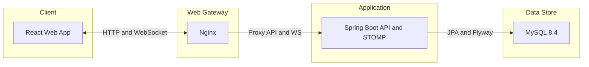

# Architecture

STOMP simple broker và Swagger UI chạy bên trong cùng Spring Boot process nên không được vẽ thành container độc lập. Luồng realtime: SEND → JWT Principal → membership check → lưu DB → commit → publish → user queue. Receiver offline vẫn lấy lại message qua sync API.
