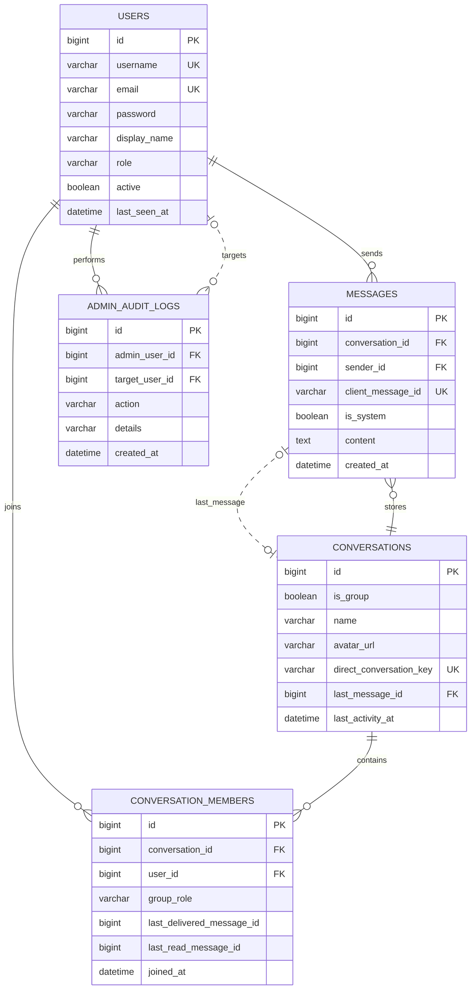

# Entity relationship diagram

```mermaid
erDiagram
    USERS ||--o{ CONVERSATION_MEMBERS : joins
    CONVERSATIONS ||--o{ CONVERSATION_MEMBERS : contains
    USERS ||--o{ MESSAGES : sends
    CONVERSATIONS ||--o{ MESSAGES : stores
    MESSAGES o|..o| CONVERSATIONS : last_message
    USERS ||--o{ ADMIN_AUDIT_LOGS : performs
    USERS o|..o{ ADMIN_AUDIT_LOGS : targets

    USERS {
        bigint id PK
        varchar username UK
        varchar email UK
        varchar password
        varchar display_name
        varchar role
        boolean active
        datetime last_seen_at
    }
    CONVERSATIONS {
        bigint id PK
        boolean is_group
        varchar name
        varchar avatar_url
        varchar direct_conversation_key UK
        bigint last_message_id FK
        datetime last_activity_at
    }
    CONVERSATION_MEMBERS {
        bigint id PK
        bigint conversation_id FK
        bigint user_id FK
        varchar group_role
        bigint last_delivered_message_id
        bigint last_read_message_id
        datetime joined_at
    }
    MESSAGES {
        bigint id PK
        bigint conversation_id FK
        bigint sender_id FK
        varchar client_message_id UK
        boolean is_system
        text content
        datetime created_at
    }
    ADMIN_AUDIT_LOGS {
        bigint id PK
        bigint admin_user_id FK
        bigint target_user_id FK
        varchar action
        varchar details
        datetime created_at
    }
```

Unique constraints: `direct_conversation_key`, `(conversation_id,user_id)` và `(sender_id,client_message_id)`.
